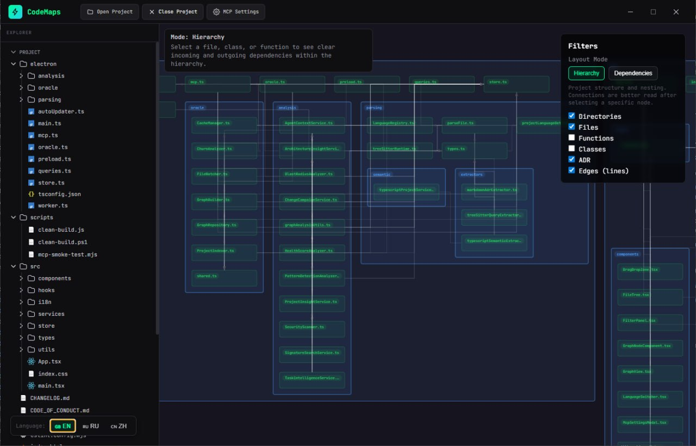
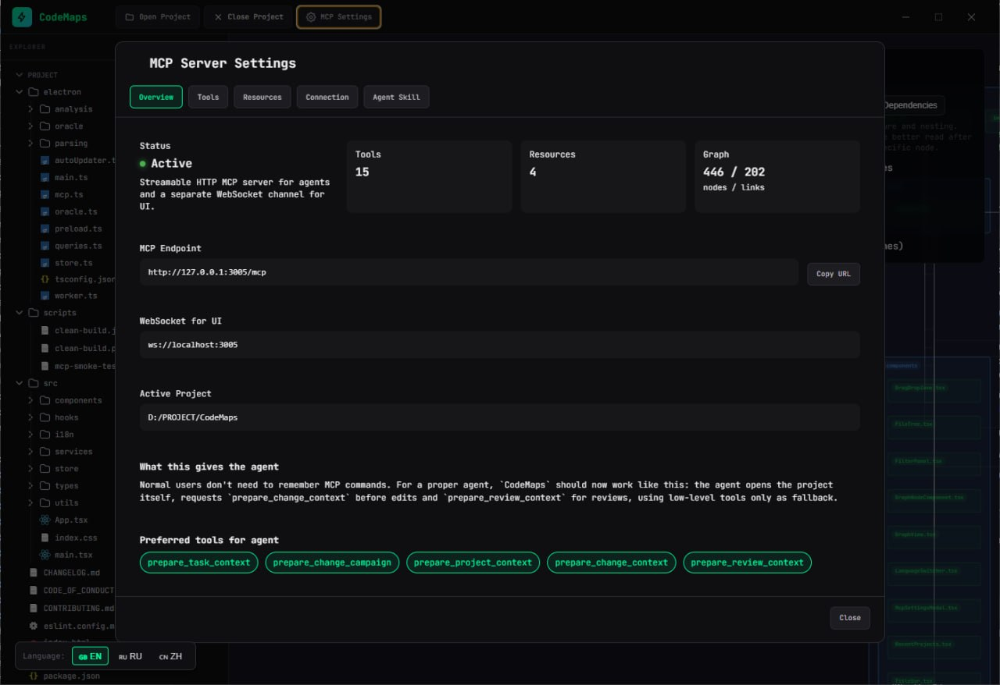
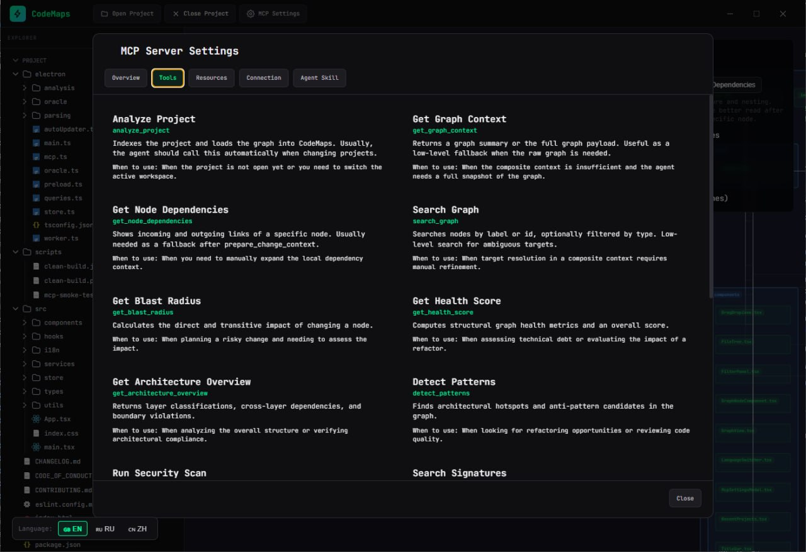
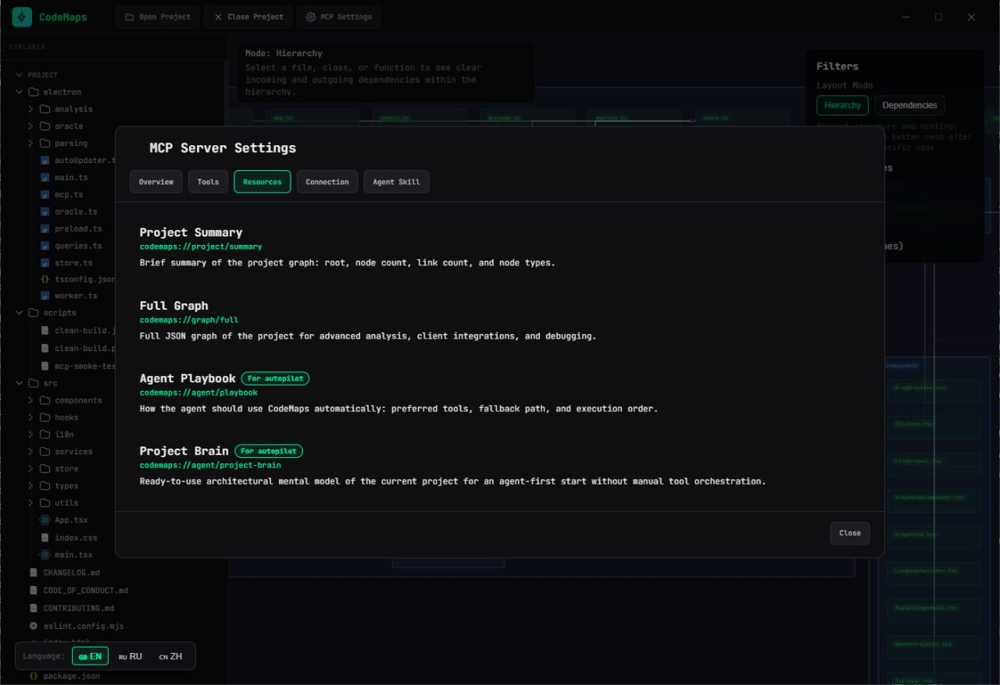

<div align="center">
  <p>
    <a href="README.md">🇺🇸 English</a> | 
    <a href="README.ru.md">🇷🇺 Русский</a> | 
    <a href="README.zh-CN.md">🇨🇳 简体中文</a> | 
    <a href="README.es.md">🇪🇸 Español</a> | 
    <a href="README.ja.md">🇯🇵 日本語</a> | 
    <a href="README.ko.md">🇰🇷 한국어</a>
  </p>
</div>

# CodeMaps

**CodeMaps**는 코드베이스 아키텍처를 시각화하고 AI 어시스턴트에게 아키텍처 컨텍스트를 제공하는 강력한 도구입니다. 이 애플리케이션은 프로젝트의 "라이브" 종속성 그래프를 구축하여 개발자와 신경망이 구조, 관계, 기술 부채를 더 잘 이해할 수 있도록 돕습니다.

## 🚀 주요 기능

- **자동 그래프 구축**: AST와 tree-sitter를 통한 심층 의미론적 코드 분석으로 파일, 클래스, 함수 간의 관계를 식별합니다.
- **Model Context Protocol (MCP) 통합**: CodeMaps는 MCP 서버로 작동하여 AI 어시스턴트(예: Trae, Claude, Cursor)가 프로젝트 아키텍처를 "보고", 종속성을 분석하고, 변경의 결과를 예측할 수 있도록 합니다.
- **아키텍처 분석**:
  - **Blast Radius**: 특정 모듈을 변경할 때 영향을 받는 것을 평가합니다.
  - **Health Score**: 순환 종속성과 아키텍처 안티패턴을 식별합니다.
  - **Security Scanner**: 코드 구조에서 잠재적 취약점을 기본적으로 검색합니다.
- **로컬 실행**: 모든 분석은 사용자의 머신에서 로컬로 이루어집니다. 소스 코드는 어디에도 전송되지 않습니다.

---

## 🖼️ 스크린샷

### 인터랙티브 코드 그래프
파일, 클래스, 함수 및 그들의 관계를 포함하여 전체 코드베이스를 인터랙티브 그래프로 시각화합니다.



### MCP 서버 설정 — 개요
CodeMaps는 HTTP 및 WebSocket 엔드포인트가 있는 MCP 서버를 실행하여 AI 에이전트가 프로젝트 아키텍처에 구조적으로 액세스할 수 있도록 합니다.



### MCP 도구
AI 에이전트를 위한 10개 이상의 내장 도구: 프로젝트 분석, 그래프 컨텍스트 가져오기, 노드 검색, 패턴 감지, 보안 스캔 실행 등.



### MCP 리소스
리소스는 AI 에이전트에 고수준 프로젝트 요약, 전체 그래프 내보내기 및 자율 실행 플레이북을 제공합니다.



---

## 📦 설치

[Releases](https://github.com/Zilk102/CodeMaps/releases) 페이지에서 플랫폼에 맞는 최신 버전을 다운로드하세요.

이 애플리케이션은 복잡한 설치 없이 **Windows**, **Linux**, **macOS**에서 바로 작동합니다.

### 빠른 시작

```bash
# 플랫폼에 맞는 최신 릴리스를 다운로드하세요
# Windows: CodeMaps-x.x.x-win-x64.exe
# Linux: CodeMaps-x.x.x-linux-x86_64.AppImage (또는 .deb, .rpm)

# 실행하세요 — 설치가 필요 없습니다!
```

---

## 🛠️ 개발

프로젝트는 다음 스택으로 구축되었습니다: **Electron + React + TypeScript + Vite**. 그래프 시각화에는 Sigma.js를 사용합니다.

### 필수 조건

- Node.js 20+
- npm 또는 yarn

### 로컬에서 실행

```bash
# 리포지토리 클론
git clone https://github.com/Zilk102/CodeMaps.git
cd CodeMaps

# 의존성 설치
npm install

# 개발 모드로 애플리케이션 시작
npm run dev
```

### 빌드

```bash
# 프로덕션 빌드 생성 (Portable)
npm run build:portable

# 또는 모든 형식 빌드
npm run build
```

---

## 🤝 기여하기

프로젝트 개발에 어떤 도움이든 환영합니다! Pull Request를 생성하기 전에 [기여 가이드](CONTRIBUTING.md)를 읽어주세요.

---

## 📄 라이선스

이 프로젝트는 MIT 라이선스에 따라 배포됩니다. 자세한 내용은 [LICENSE](LICENSE) 파일을 참조하세요.
